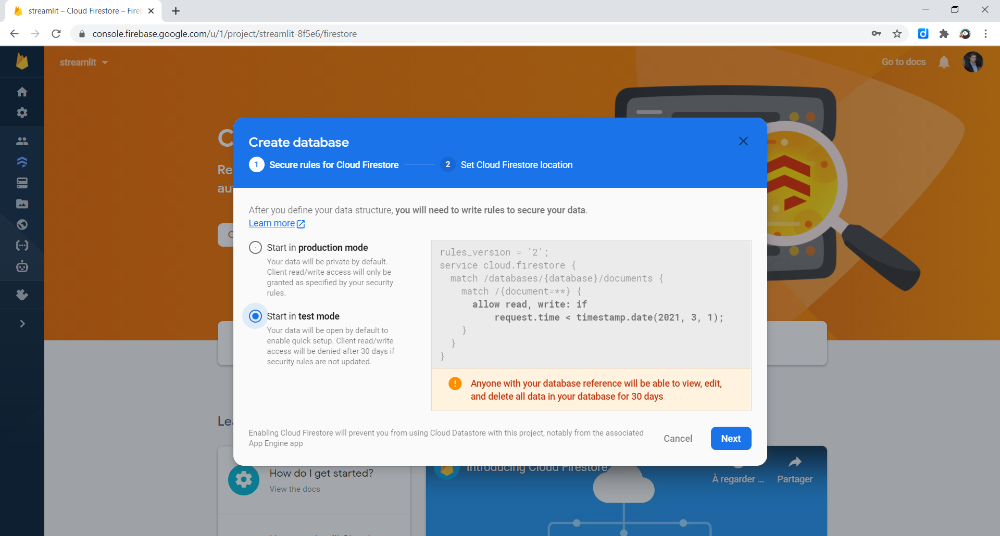
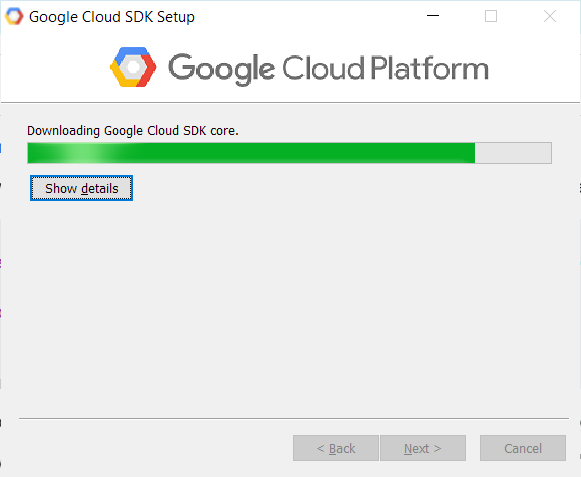
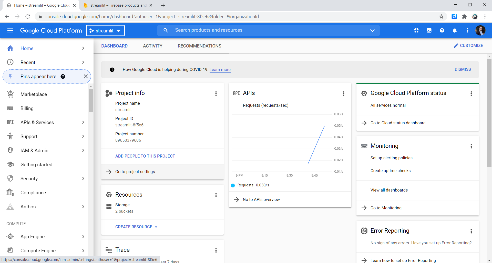
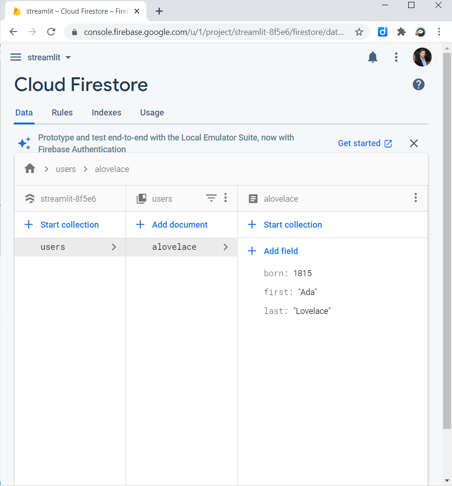

# firestore 🔥
Firestore called from Streamlit apps

https://discuss.streamlit.io/t/streamlit-firestore/9224

https://firebase.google.com/docs/firestore

https://googleapis.dev/python/firestore/latest/index.html

## Create a Firestore database 🔥
Start it in test mode, which means anyone can read or write to it for the next 30 days (you can change this later!)



## SDK Cloud

https://cloud.google.com/sdk



## Download account keys 🗝️

To download this JSON file, first go to "Project settings":


## Python Client for Google Cloud Firestore

```python
from google.cloud import firestore

# Add a new document
db = firestore.Client.from_service_account_json("firestore-key.json")
doc_ref = db.collection(u'users').document(u'alovelace')
doc_ref.set({
    u'first': u'Ada',
    u'last': u'Lovelace',
    u'born': 1815
})

# Then query for documents
users_ref = db.collection(u'users')

for doc in users_ref.stream():
    print(u'{} => {}'.format(doc.id, doc.to_dict()))

```



[Setup Authentication](https://googleapis.dev/python/google-api-core/latest/auth.html)

`
gcloud auth application-default login
`

Credentials saved to file: [C:\Users\badmo\AppData\Roaming\gcloud\application_default_credentials.json]
[C:\Users\badmo\AppData\Roaming\gcloud\application_default_credentials.json


Source:
https://discuss.streamlit.io/t/streamlit-firestore/9224